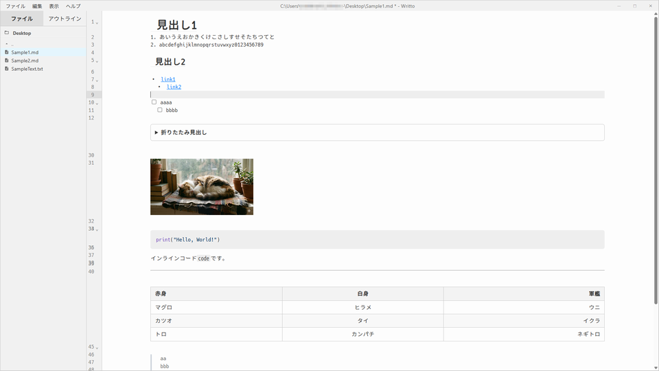

# Writto

[English](#english) | [日本語](#japanese)

---

<a name="english"></a>
## English

An inline Markdown editor built with Tauri, React, and TypeScript.



### Download

Download the latest version from [GitHub Releases](https://github.com/takatetsu/writto/releases).

Download the Windows installer (`.exe`).

### Features

- **Inline Rendering**: Hides Markdown syntax when not editing, displaying a preview-like view
  - Improved blockquote rendering with text alignment on wrapped lines
  - Code blocks display with proper line number alignment
- **View/Edit Mode Switching**: Seamlessly switch between reading and editing
  - **View Mode**: Click to move cursor without entering edit mode
  - **Edit Mode Entry**: Double-click or press Enter to start editing
  - **Edit Mode Exit**: Press Escape to return to view mode
  - Visual indicator (blue background and left border) shows current edit location
- **Code Block Copy**: One-click code copying with visual feedback
- **File Operations**: New, Open, Save, Save As
- **Sidebar**: File tree and outline view
- **Search & Replace**: Regex-supported search functionality
- **Export**: HTML export
- **Print**: Print and save as PDF
- **Settings**: Customizable font size, font family, and editor width (50%-100%)
- **Table Support**: GFM-compliant table rendering with alignment support
  - **Table Editing**: Insert tables via context menu, add/delete rows and columns
- **Mermaid Diagrams**: Support for Mermaid diagram rendering
- **Line Numbers**: Toggle line numbers display
- **Word Wrap**: Toggle word wrap
- **Dark Mode**: Full dark mode support
- **Internationalization**: English and Japanese UI support

### For Developers

If you want to clone this repository and develop, follow the steps below.

#### Prerequisites

- **Node.js**: For frontend dependency management and build
- **Rust**: For building the Tauri backend
  - [Install Rust](https://www.rust-lang.org/tools/install)

#### Setup and Run

1. **Install Dependencies**

   Run the following command in the project root directory to install required packages:

   ```bash
   npm install
   ```

2. **Run in Development Mode**

   Run the following command to start the application in development mode with hot reload enabled:

   ```bash
   npm run tauri dev
   ```

   The first run may take some time to compile Rust dependencies.

3. **Production Build**

   To build the application for distribution, run:

   ```bash
   npm run tauri build
   ```

   The built installer and executable will be output to the `src-tauri/target/release/bundle` directory.

### License

This project is licensed under the MIT License - see the [LICENSE](LICENSE) file for details.

---

<a name="japanese"></a>
## 日本語

Tauri、React、TypeScript で構築された、インラインで動作する Markdown エディタです。

### ダウンロード

最新版は [GitHub Releases](https://github.com/takatetsu/writto/releases) からダウンロードできます。

Windows 版のインストーラー（`.exe`）をダウンロードしてください。

### 機能

- **インラインレンダリング**: 編集していない Markdown 記法を隠し、プレビューのように表示します
  - 引用ブロックの折り返し時に文字開始位置を揃えて表示
  - コードブロックの行番号との整合性を確保
- **表示/編集モードの切り替え**: 読みやすさと編集しやすさを両立
  - **表示モード**: クリックでカーソル移動のみ、編集モードにはなりません
  - **編集モードへの切り替え**: ダブルクリックまたはEnterキーで編集開始
  - **編集モードの終了**: Escキーで表示モードに戻る
  - 現在の編集位置は青い背景と左側のバーで視覚的に表示
- **コードブロックのコピー**: ワンクリックでコードをコピー、視覚的なフィードバック付き
- **ファイル操作**: 新規作成、開く、保存、名前を付けて保存
- **サイドバー**: ファイルツリーとアウトライン表示
- **検索と置換**: 正規表現対応の検索機能
- **エクスポート**: HTML 形式でのエクスポート
- **印刷**: 印刷および PDF 保存
- **設定**: フォントサイズ、フォントファミリー、エディタ幅（50%-100%）の変更
- **テーブルサポート**: GFM準拠のテーブルレンダリング（配置対応）
  - **テーブル編集**: 右クリックメニューで表の挿入、行/列の追加・削除
- **Mermaid**: Mermaid図のレンダリング対応
- **行番号**: 行番号の表示切り替え
- **ワードラップ**: ワードラップの切り替え
- **ダークモード**: 完全なダークモード対応
- **多言語化**: 英語と日本語のUI対応

### 開発者向け情報

このリポジトリをクローンして開発する場合は、以下の手順に従ってください。

#### 前提条件

- **Node.js**: フロントエンドの依存関係管理とビルドに使用します
- **Rust**: Tauri バックエンドのビルドに使用します
  - [Rust のインストール方法](https://www.rust-lang.org/tools/install)

#### セットアップと実行

1. **依存関係のインストール**

   プロジェクトのルートディレクトリで以下のコマンドを実行し、必要なパッケージをインストールします。

   ```bash
   npm install
   ```

2. **開発モードで実行**

   以下のコマンドを実行すると、アプリケーションが開発モードで起動します。ホットリロードが有効になっています。

   ```bash
   npm run tauri dev
   ```

   初回起動時は Rust の依存関係のコンパイルに時間がかかる場合があります。

3. **プロダクションビルド**

   配布用のアプリケーションをビルドするには、以下のコマンドを実行します。

   ```bash
   npm run tauri build
   ```

   ビルドされたインストーラーや実行ファイルは `src-tauri/target/release/bundle` ディレクトリに出力されます。

### ライセンス

このプロジェクトは MIT ライセンスの下でライセンスされています。詳細は [LICENSE](LICENSE) ファイルをご覧ください。
